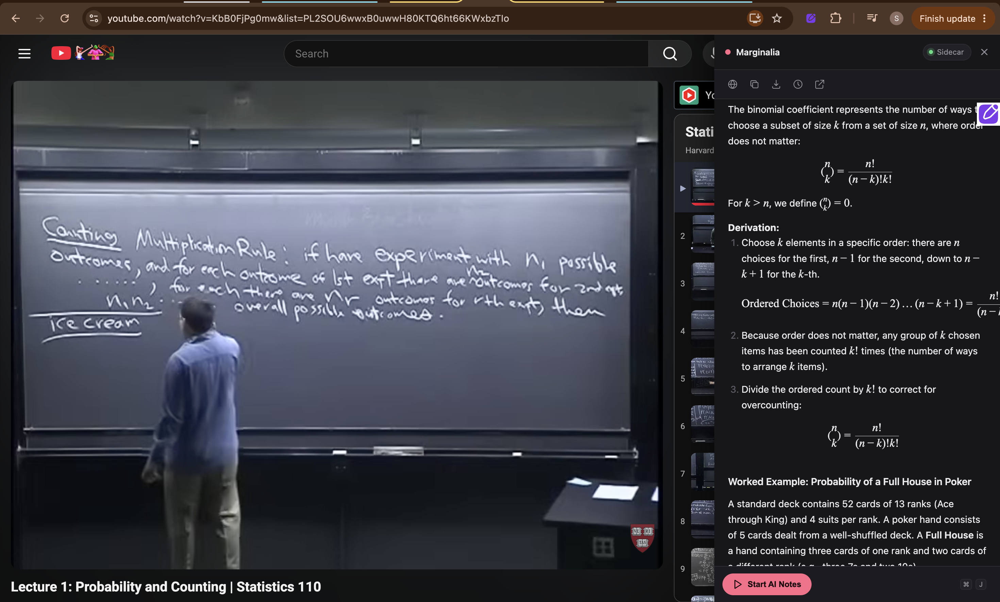
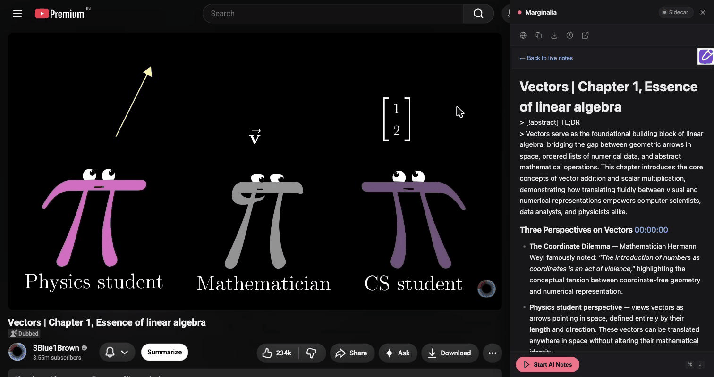

# 📓 Marginalia


> **Live lecture notes from YouTube, written straight into your Obsidian vault while you watch.** Press Start, keep watching, and a real note builds itself in a side panel: timestamped sections, math rendered properly, board content folded into the text when it adds something the transcript alone would miss.

> _The margin, but of the video instead of the page._

```
███╗   ███╗ █████╗ ██████╗  ██████╗ ██╗███╗   ██╗ █████╗ ██╗     ██╗ █████╗ 
████╗ ████║██╔══██╗██╔══██╗██╔════╝ ██║████╗  ██║██╔══██╗██║     ██║██╔══██╗
██╔████╔██║███████║██████╔╝██║  ███╗██║██╔██╗ ██║███████║██║     ██║███████║
██║╚██╔╝██║██╔══██║██╔══██╗██║   ██║██║██║╚██╗██║██╔══██║██║     ██║██╔══██║
██║ ╚═╝ ██║██║  ██║██║  ██║╚██████╔╝██║██║ ╚████║██║  ██║███████╗██║██║  ██║
╚═╝     ╚═╝╚═╝  ╚═╝╚═╝  ╚═╝ ╚═════╝ ╚═╝╚═╝  ╚═══╝╚═╝  ╚═╝╚══════╝╚═╝╚═╝  ╚═╝
```

---

## 📋 Table of Contents

1. [The Problem](#-the-problem)
2. [The Solution](#-the-solution)
3. [Features](#-features)
4. [Preview](#-preview)
5. [Architecture](#-architecture)
6. [Frame Selection Pipeline](#-frame-selection-pipeline)
7. [Installation](#-installation)
8. [How to Use](#-how-to-use)
9. [Setting Up the Gemini Engine](#-setting-up-the-gemini-engine-optional)
10. [File Structure](#-file-structure)
11. [Testing](#-testing)
12. [Security Notes](#-security-notes)
13. [Roadmap](#-roadmap)
14. [FAQ](#-faq)
15. [Why I Built This](#-why-i-built-this)
16. [License](#-license)

---

## 😤 The Problem

You're watching a lecture. You either:

- Keep pausing every 30 seconds to write something down, and never actually finish the video, or
- Watch it straight through, take no notes, and have nothing to study from a week later.

HoverNotes (the real, paid extension) solves this well. But it's paid, and I wanted to actually understand how a "watch a video, get a live note" pipeline works instead of just paying for someone else's.

This is the problem Marginalia was built to solve.

---

## 💡 The Solution

```
YouTube video ──▶ transcript + (optional) video frames ──▶ note-writing model
                                                                    │
                                                                    ▼
                                              a real, growing note in a side panel
                                                                    │
                                              you hit Stop  ────────┘
                                                                    │
                                                                    ▼
                              full-video re-generation (TL;DR, thematic sections, glossary)
                                                                    │
                                                                    ▼
                                                        written into your Obsidian vault
```

**Marginalia** is a Chrome extension that:

1. **Injects a panel** into any YouTube video page, no click required
2. **Batches the transcript** into ~60-second chunks as the video plays and POSTs each to a local FastAPI sidecar
3. **Writes a real note section** for every chunk and appends it straight into your Obsidian vault
4. **Regenerates the whole note** the moment you hit Stop, using the full transcript (and optionally the video's frames) for real coherence instead of a script's worth of headers
5. **Optionally watches the frames too** (Gemini engine) and folds board or slide content into the note when the transcript alone would miss it

No cloud servers beyond whichever model API you've configured (Anthropic via your own `claude` CLI login, or Google's Gemini). No sign-up, no accounts of its own. Everything runs on `localhost`.

---

## ✨ Features

### 📝 Note Generation

| Feature | Status |
|---|---|
| Live, incremental notes (~every 60s of video) | ✅ Live |
| Timestamped section links (`[HH:MM:SS](videoUrl&t=Ns)`) | ✅ Live |
| Full-context regeneration on Stop (TL;DR + thematic sections + glossary) | ✅ Live |
| Duplicate-section detection (won't repeat a section it already wrote) | ✅ Live |
| Math rendering (KaTeX, `$...$` / `$$...$$`) | ✅ Live |

### 🧠 Engines

| Feature | Status |
|---|---|
| `haiku` engine, transcript only, your existing Claude Pro/Max login | ✅ Default |
| `gemini` engine, transcript + candidate video frames | ✅ Optional |
| Per-frame usefulness judgment (paraphrase into prose, or silently discard) | ✅ Live |
| Invisible `<!-- screenshot: HH:MM:SS -->` provenance marker, never a pasted image | ✅ Live |
| Multi-key rotation across Gemini's 20-calls/day/key free tier | ✅ Live |

### 🗂️ In-Panel File Browser

| Feature | Status |
|---|---|
| Search past notes by title | ✅ Live |
| Open a note inline (screenshots + math render correctly) | ✅ Live |
| Jump back to the live session without losing it | ✅ Live |
| Toolbar icon toggles the panel on/off, any time | ✅ Live |

### 🛠️ Action Bar

| Feature | Status |
|---|---|
| 🌐 Open the source video | ✅ Live |
| 📋 Copy the note as markdown | ✅ Live |
| ⬇️ Download the note as `.md` | ✅ Live |
| 🕐 Browse all notes | ✅ Live |
| 🔗 Open the note directly in Obsidian (`obsidian://open`) | ✅ Live |

---

## 🖼️ Preview

### The panel, live, mid-lecture



> A real session: Harvard's Stat 110 (Probability), notes generating live in the side panel as the lecture plays, section headers, KaTeX-rendered math, a worked example, all written straight into the vault note in the background.

### Opening a past note from the in-panel file browser



> A real, previously-generated note for this exact video (3Blue1Brown's *Essence of Linear Algebra*, Chapter 1), opened from the panel's file browser: TL;DR, timestamped sections, and inline math rendering.

---

## 🏗️ Architecture

```
┌──────────────────────────────────────────────────────────────────────────┐
│                       Chrome Extension (MV3)                             │
│                                                                            │
│  ┌────────────────────┐   ┌──────────────────┐   ┌────────────────────┐ │
│  │  content-script.js  │──▶│     panel.js      │──▶│    renderer.js     │ │
│  │  injects the panel, │   │  batching, state,  │   │  markdown → HTML,  │ │
│  │  reserves page space│   │  action bar wiring │   │  XSS sanitization  │ │
│  └──────────┬───────────┘  └─────────┬─────────┘   └─────────────────────┘ │
│             │                        │                                    │
│  ┌──────────▼───────────┐  ┌─────────▼─────────┐                          │
│  │    background.js      │  │   transcript.js    │                        │
│  │  toolbar-icon toggle   │  │  batching helpers  │                        │
│  └───────────────────────┘  └────────────────────┘                        │
└───────────────────────────────────┬──────────────────────────────────────┘
                                     │ HTTP, localhost:8765
                                     ▼
┌──────────────────────────────────────────────────────────────────────────┐
│                    FastAPI Sidecar (sidecar/)                            │
│                                                                            │
│   main.py ── routes: /note-chunk, /finalize-note, /documents, /transcript │
│      │                                                                    │
│      ├─▶ haiku_client.py ──── claude CLI, transcript-only                │
│      ├─▶ gemini_client.py ─── Gemini API, transcript + frames            │
│      │        │                                                          │
│      │        ├─▶ frame_extractor.py ── yt-dlp download + phash sampling │
│      │        └─▶ key_rotation.py ───── round-robins multiple API keys   │
│      ├─▶ finalize.py ──────── whole-video regeneration on Stop           │
│      ├─▶ transcript_fetcher.py ── youtube_transcript_api                 │
│      └─▶ vault_writer.py ──── frontmatter, file I/O, dedupe              │
└───────────────────────────────────┬──────────────────────────────────────┘
                                     ▼
                          your Obsidian vault (.md + images)
```

### How it works under the hood

`content-script.js` injects the panel on every YouTube watch page, reserves layout space so the video actually shrinks instead of being covered, and polls the sidecar's `/health` every 15s for the live status dot.

`panel.js` batches the transcript into ~60s chunks as the video plays, POSTs each to `/note-chunk`, and renders the response. On Stop, it calls `/finalize-note`.

`main.py` routes to either `haiku_client.py` or `gemini_client.py` depending on `NOTE_ENGINE`. The Gemini path also calls `frame_extractor.py` for that chunk's time window, best-effort: a frame-capture failure degrades to text-only, never blocks the note.

`finalize.py` discards the rough live draft, refetches the full transcript, re-extracts frames across the whole video, and makes one Gemini call for the complete note.

`vault_writer.py` handles frontmatter, filename collisions, and `dedupe_section()` so a retried chunk never gets written twice.

---

## ⚙️ Frame Selection Pipeline

> **Status:** shipped, hardened against a real YouTube CDN reliability problem hit mid-project.

```
Chunk time window (e.g. 00:01:00-00:02:00)
        │
        ▼
1. DOWNLOAD
   yt-dlp downloads just that clip directly (its own downloader handles YouTube's
   bot detection correctly, since it's what resolved the URL) -- 3 retries, since
   the exact same request has been observed succeeding and failing seconds apart

        │
        ▼
2. INTERVAL SAMPLING
   ffmpeg samples one candidate frame every 3 seconds from the local clip
   (no more network calls involved from here on)

        │
        ▼
3. PERCEPTUAL HASH DEDUP
   imagehash.phash() on each candidate; a frame is kept only if its hash differs
   from the last kept frame by more than a Hamming-distance threshold -- a static
   slide held for 10s, or minor camera jitter, collapses down to one frame

        │
        ▼
4. GEMINI JUDGES EACH SURVIVING FRAME
   shows a formula/diagram not in the transcript?  -> paraphrase into prose,
                                                       mark with <!-- screenshot: HH:MM:SS -->
   empty, redundant, mid-transition?                -> discard, no trace in the note
```

Why download the clip instead of handing `ffmpeg` a raw stream URL directly? Confirmed live, by direct experimentation: YouTube's edge servers reject some signed URLs unpredictably, even with matching request headers, even when the *exact same URL* `yt-dlp` itself just resolved gets handed straight back to it seconds later. `yt-dlp`'s own downloader replicates whatever YouTube actually requires (proven, since it's what got the URL in the first place); `ffmpeg` fetching that URL independently does not.

---

## 🚀 Installation

Since this is a personal, unpublished project, it runs from source in **Developer Mode**.

**Prerequisites:** Python 3.10+, Node.js, [`yt-dlp`](https://github.com/yt-dlp/yt-dlp) and `ffmpeg` on your `PATH` (only needed for the optional Gemini engine's frame capture; skip those two if you're sticking with the default Haiku engine). Currently macOS/Linux only; Windows isn't tested (see [ISSUES.md](ISSUES.md)).

**No Claude Pro/Max?** The default engine below needs an existing `claude` CLI login. If you don't have one, skip straight to [Setting Up the Gemini Engine](#-setting-up-the-gemini-engine-optional) instead: free API key, no CLI required.

### Step 1: Confirm the Haiku engine works

Default engine, no extra setup. Needs the `claude` CLI already installed and logged into a Claude Pro/Max account.

```bash
claude -p --model haiku "say hi"
```

### Step 2: Set up the sidecar

```bash
python3 -m venv venv
source venv/bin/activate
pip install -r sidecar/requirements.txt
npm install
```

### Step 3: Point it at your own vault (optional)

Defaults to `~/MarginaliaNotes`, created automatically on first run. To point it at an existing [Obsidian](https://obsidian.md) vault instead:

```bash
export MARGINALIA_VAULT_PATH=/path/to/your/vault
```

### Step 4: Start the sidecar

```bash
source venv/bin/activate && uvicorn sidecar.main:app --port 8765
```

### Step 5: Load the extension

Go to `chrome://extensions`, enable **Developer Mode**, click **Load unpacked**, and select the `extension/` folder.

---

## 🛠️ How to Use

### Basic usage (Haiku engine, no API key required)

#### 1. Open any YouTube video with captions

The extension activates automatically on `/watch` pages; no click required.

#### 2. Hit Start AI Notes

Click the toolbar icon if the panel isn't already visible, then **Start AI Notes** in the panel's toolbar. Keep watching; a new section appears roughly every 60 seconds.

#### 3. Hit Stop AI Notes when you're done

The note gets rewritten with a TL;DR, thematic sections, and a glossary, using the full video's context instead of the rough live draft.

#### 4. Use the action bar

Open the source video, copy or download the note, browse past notes, or open the current one directly in Obsidian.

---

## 🔑 Setting Up the Gemini Engine (optional)

> Vision, not compression, is the point here. The transcript alone misses anything written on a board or slide but never said out loud; the Gemini engine catches that, via the pipeline described [above](#-frame-selection-pipeline).

### Step 1: Get a free Gemini API key

Go to [Google AI Studio](https://aistudio.google.com/), sign in, and create a key.

### Step 2: Add it to `~/.config/keys.env`

Copy [`keys.env.example`](keys.env.example) to `~/.config/keys.env` and fill in your key:

```bash
GEMINI_API_KEY=AIzaSy...yourkey...
GEMINI_API_KEY_2=AIzaSy...secondkey...   # optional, extra Google account
GEMINI_API_KEY_3=AIzaSy...thirdkey...    # optional
```

### Step 3: Start the sidecar with the engine flag

```bash
MARGINALIA_ENGINE=gemini uvicorn sidecar.main:app --port 8765
```

### Why multiple keys?

Gemini's free tier caps at 20 `generateContent` calls/day *per key* for `gemini-3.5-flash`. Live note-taking fires roughly one call per 60s chunk, so a single normal-length lecture can burn a whole day's quota on its own. `key_rotation.py` round-robins across however many keys you configure, falling through immediately on a 429 instead of backing off a quota that won't reset for hours anyway.

> **Privacy:** with the Gemini engine active, that chunk's transcript text and candidate frames are sent to Google's API. The `haiku` engine sends transcript text to Anthropic via your existing `claude` CLI login. Neither engine sends anything anywhere else; the sidecar itself has no telemetry and talks to nothing but `localhost` and whichever engine you picked.

---

## 📁 File Structure

```
marginalia/
├── extension/
│   ├── manifest.json          ← MV3 config, host permissions
│   ├── background.js          ← toolbar-icon click → toggle panel
│   ├── content-script.js      ← injects the panel, page-layout reflow
│   ├── panel.js                ← batching, state, action bar, file browser
│   ├── renderer.js            ← markdown → HTML, XSS sanitization
│   ├── transcript.js          ← chunk-batching helpers
│   ├── panel.css              ← panel UI, typography, action bar
│   └── *.test.js              ← vitest unit tests
├── sidecar/
│   ├── main.py                 ← FastAPI routes
│   ├── config.py               ← engine toggle, key loading
│   ├── haiku_client.py        ← claude CLI, transcript-only
│   ├── gemini_client.py       ← Gemini API, transcript + frames
│   ├── frame_extractor.py     ← yt-dlp download + perceptual-hash sampling
│   ├── key_rotation.py        ← multi-key round-robin
│   ├── finalize.py             ← whole-video regeneration on Stop
│   ├── transcript_fetcher.py  ← youtube_transcript_api
│   ├── vault_writer.py        ← frontmatter, file I/O, dedupe
│   └── tests/                  ← pytest suite
├── ISSUES.md                   ← local backlog, becomes GitHub Issues at go-public
└── README.md
```

### Key constants

| File | Constant | Default | Description |
|---|---|---|---|
| `sidecar/config.py` | `NOTE_ENGINE` | `"haiku"` | `MARGINALIA_ENGINE` env var overrides |
| `sidecar/frame_extractor.py` | `interval` | `3.0` sec | How often a candidate frame is sampled |
| `sidecar/frame_extractor.py` | `hash_threshold` | `5` | Hamming distance a frame must clear vs. the last kept one |
| `sidecar/frame_extractor.py` | `DOWNLOAD_ATTEMPTS` | `3` | Retries on YouTube CDN 403 |
| `sidecar/gemini_client.py` | `MAX_ATTEMPTS` | `3` | Retries on Gemini 429/503 |
| `extension/panel.js` | `BATCH_DURATION_SEC` | `60` | Live chunk size, in video-seconds |

---

## 🧪 Testing

```bash
# Sidecar
source venv/bin/activate && python -m pytest sidecar/tests/ -v

# Extension pure-logic units
npm test
```

Everything DOM-level (panel rendering, in-browser interactions) is manually verified in a live browser, not covered by the automated suites above.

---

## 🔒 Security Notes

Notes are rendered as live HTML (not plain text) to support markdown formatting and math rendering. Note content and metadata originate from public YouTube video transcripts and titles, which are not fully trusted input: an attacker could craft a maliciously-worded video title or transcript to target the extension. The renderer sanitizes unsafe URL schemes (`javascript:`, `data:`) in links and images, and HTML-escapes video titles and domains before inserting them into the DOM. The one deliberate, narrow exception is the Gemini engine's `<!-- screenshot: HH:MM:SS -->` provenance marker, matched by a strict digits-only pattern that can't smuggle a script tag and rendered as fully invisible, matching how Obsidian treats real HTML comments. If you encounter unexpected script execution in the panel, report it as a security issue.

---

## 🗺️ Roadmap

Full backlog lives in [`ISSUES.md`](ISSUES.md).

### v0.2.0: Portability
- [x] Configurable `VAULT_PATH` (env var, sane default) instead of hardcoded
- [ ] Standard `.env` for the Gemini keys instead of the bespoke `~/.config/keys.env` parser (a documented [`keys.env.example`](keys.env.example) exists in the meantime)

### v0.3.0: Infrastructure
- [ ] Basic CI (GitHub Actions) running both test suites on every push
- [ ] Chrome Web Store packaging, or at least a signed release archive

### v1.0.0: Public
- [ ] Everything above cleared
- [x] Real screenshots and a short demo GIF in this README

---

## ❓ FAQ

**Q: The panel shows "Sidecar offline."**
A: The sidecar isn't running, or crashed. Start it with the command in [Installation](#-installation), step 4. The status dot polls `/health` every 15s and updates automatically once it's back.

**Q: Live notes look choppy / sections end mid-thought.**
A: Expected. Each 60s chunk only sees its own transcript slice, which is why Stop's full-context regeneration exists. Live is a rough draft; the real output happens on Stop.

**Q: Gemini engine gives a 502 error.**
A: Either no `GEMINI_API_KEY` is configured, or you've exhausted the daily quota on all configured keys. Add a key, or wait for the daily reset (~24h from first use).

**Q: Frame capture isn't finding anything / no screenshots in the note.**
A: Either the video has nothing worth capturing (Gemini judged every frame redundant or empty, which is correct behavior, not a bug), or YouTube's CDN rejected the download. Check the sidecar logs for `"Frame extraction failed"`; if it's a 403, that's the known CDN flakiness described in the [Frame Selection Pipeline](#-frame-selection-pipeline), already retried 3 times before falling back to text-only.

**Q: Can I use this on Udemy / Coursera / a local video file?**
A: Not yet. YouTube only for now. A later, separate project.

---

## 💭 Why I Built This

It went through a few real iterations, not a one-shot build:

- Started transcript-only (Claude Haiku via the local `claude` CLI, no API key, no vision).
- Tried scraping YouTube's own transcript panel DOM: brittle, broke whenever YouTube changed a class name. Switched to `youtube_transcript_api` server-side instead.
- Added the Gemini engine because some of what's worth noting is written on the board and never said out loud. Ran a real side-by-side experiment (live chunk-by-chunk vs. whole-video batch) to check whether frame capture actually helped, or just added noise. It helped, on the same chunk-blindness axis that turned out to matter more than which model was writing.
- Rebuilt the finalize step around that finding: instead of tuning live per-chunk notes forever, the whole note gets regenerated with full-video context the moment you hit Stop.

---

## 📄 License

MIT License, see [LICENSE](LICENSE) for details.

---

<div align="center">

Built with ❤️ by Saksham Arora

</div>
